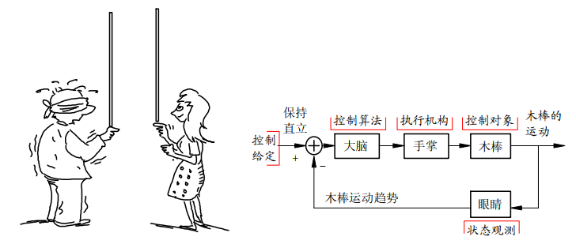
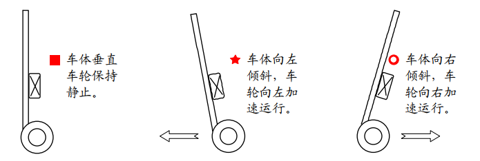
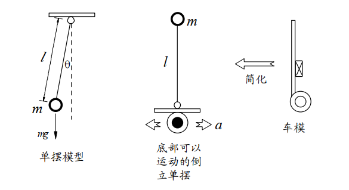
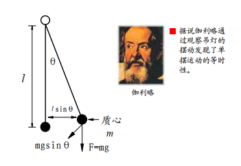
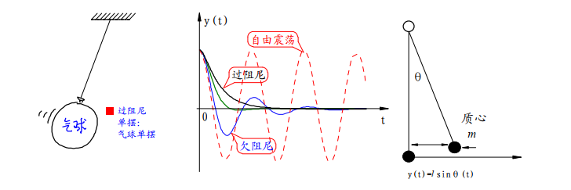
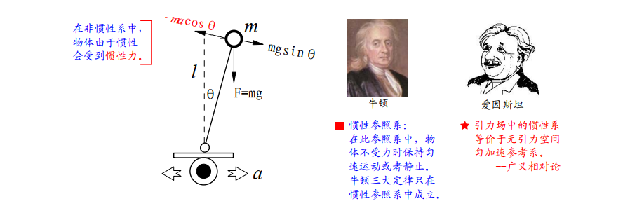
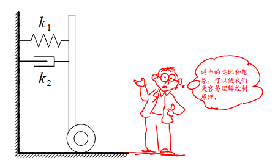
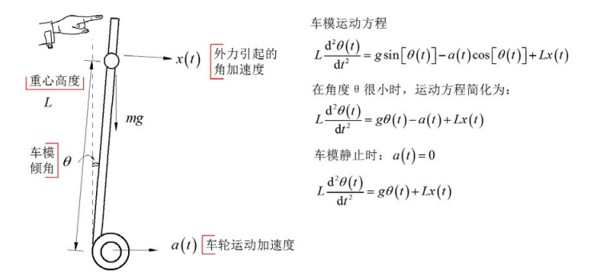
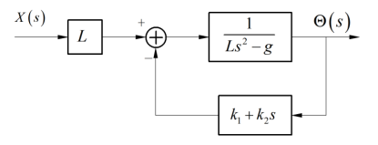

# 平衡原理

控制小车平衡的直观经验来自于人们日常生活经验。一般的人通过简单练习就可以让一个直木棒在手指尖上保持直立。这需要两个条件：一个是托着木棒的手掌可以移动；  另一个是眼睛可以观察到木棒的倾斜角度和倾斜趋势（角速度）。通过手掌移动抵消木棒的倾斜角度和趋势，从而保持木棒的直立。这两个条件缺一不可，实际上就是控制中的负反馈机制。  

世界上还没有任何一个天才杂技演员可以蒙着眼睛使得木棒在自己指尖上直立，因为没有了眼睛观察进行负反馈。  

小车平衡控制也是通过负反馈来实现的，与上面保持木棒直立比较则相对简单。因为小车有两个轮子着地，车体只会在轮子滚动的方向上发生倾斜。控制轮子转动，抵消在一个维度上倾斜的趋势便可以保持车体平衡了。

那么车轮如何运行，才能够最终保持车体平衡稳定？为了回答这个问题，可以通过建立两轮自平衡小车的运动学和动力学数学模型，设计反馈控制来保证车体的平衡。为了使得同学们能够比较清楚理解其中的物理过程。下面通过对比单摆模型来说明保持车体平衡的控制规律。

### 动力学分析

重力场中使用细线悬挂着重物经过简化便形成理想化的单摆模型。直立着的小车可以看成放置在可以左右移动平台上的倒立着的单摆。  

对普通的单摆受力分析。  

当物体离开垂直的平衡位置之后，便会受到重力与悬线的作用合力，驱动重物回复平衡位置。这个力称之为回复力，其大小为

$$F=-mgsin \theta \approx -mg \theta $$

在偏移角度很小的情况下，回复力与偏移的角度之间大小成正比，方向相反。  在此回复力作用下，单摆便进行周期运动。在空气中运动的单摆，由于受到空气的阻尼力，  单摆最终会停止在垂直平衡位置。空气的阻尼力与单摆运动速度成正比，方向相反。阻尼力越大，单摆越会尽快在垂直位置稳定下来。   

不同阻尼系数下，单摆的运动曲线也不同。  

总结单摆能够稳定在垂直位置的条件有两个：  

1. 受到与位移（角度）相反的恢复力；  

2. 受到与运动速度（角速度）相反的阻尼力。  

如果没有阻尼力，单摆会在垂直位置左右摆动。阻尼力会使得单摆最终停止在垂直位置。阻尼力过小（欠阻尼）会使得单摆在平衡位置附件来回震荡。阻尼力过大（过阻尼）会使得单摆到达平衡位置时间加长，比如气球单摆。因而存在一个临界阻尼系数，使得单摆稳定在平衡位置的时间最短。  

为什么倒立摆在垂直位置时，在受到外部扰动的情况下，无法保持稳定呢？我们来分析倒立摆的受力。  

倒立摆之所以不能象单摆一样可以稳定在垂直位置，就是因为在它偏离平衡位置的时候，所受到的回复力与位移方向相同，而不是相反！因此，倒立摆便会加速偏离垂直位置，直到倒下。

如何通过控制使得倒立摆能够像单摆一样，稳定在垂直位置呢？要达到这一目的，只有两个办法：一个是改变重力的方向；另一个是增加额外的受力，使得恢复力与位移方向相反才行。显然能够做到的只有第二种方法。

控制倒立摆底部车轮，使得它作加速运动。这样站在小车上（非惯性系，以车轮作为坐标原点）分析倒立摆受力，它就会受到额外的惯性力，该力与车轮的加速度方向相反，大小成正比。这样倒立摆所受到的回复力为： 

$$
F=mgsin \theta -macos \theta \approx mg \theta -mk_1 \theta
$$
​    （2-1）

式中，由于$$\theta$$很小，所以进行了线性化。假设负反馈控制是车轮加速度$$\alpha$$与偏角$$\theta$$成正比，比例为$$k_1$$ 。如果比例$$k_1>g$$ （ $$g$$是重力加速度），那么回复力的方向便于位移方向相反了。

此外，为了使得倒立摆能够尽快地在垂直位置稳定下来，还需要增加阻尼力。虽然存在着空气和摩擦力等阻尼力，相对阻尼力比较小。因此需要另外增加控制阻尼力。增加的阻尼力与偏角的速度成正比，方向相反。因此式（2-1）可变为

$$F=mg \theta -mk_1 \theta -mk2 \theta ^1$$ （2-2）

按照上面的控制方法，可把倒立摆模型变为单摆模型，能够稳定在垂直位置。因此，可得控制车轮加速度的控制算法

$$a=k_1 \theta+k_2 \theta ^1$$ （2-3）

式中，$$\theta$$ 为车体倾角；$$\theta ^1$$为角速度；$$ k_1$$、$$k_2 $$均为比例系数；两项相加后作为车轮加速度的控制量。只要保证在$$k_1>g$$、$$k_2>0$$条件下，可以使得车体像单摆一样维持在直立状态。其中有两个控制参数$$k_1 k_2$$，$$k_1$$决定了车体是否能够稳定到垂直平衡位置，它必须大于重力加速度；$$k_2$$决定了车体回到垂直位置的阻尼系数，选取合适的阻尼系数可以保证车体尽快稳定在垂直位置。

### 数学建模

在上面简单分析中，通过类比倒立摆得到了小车直立的控制方案。下面对两轮自平衡小车进行简单数学建模，然后建立速度的比例微分负反馈控制，根据基本控制理论讨论小车通过闭环控制保持稳定的条件。 

假设两轮自平衡小车简化成高度为$$L$$，质量为$$m$$的简单倒立摆，它放置在可以左右移动的车轮上。假设外力干扰引起小车产生角加速度 $$x(t)  $$。沿着垂直于小车底盘方向进行受力分析，可以得到车体倾角与车轮运动加速度 $$a (t) $$ 以及外力干扰加速度 $$x(t) $$ 之间的运动方程。  

对应小车静止时，系统输入输出的传递函数为：  

$$
H(s)= (\frac {\Theta (s}{\chi(s)})=\frac {1}{s^2-\frac{g}{L}})
$$
此时系统具有两个极点：
$$
s_p=\pm \sqrt \frac{g}{L}
$$
一个极点位于 s 平面的右半平面，因此两轮自平衡小车不稳定。小车引入比例、微分反馈之后的系统如下图所示： 

系统传递函数为：
$$
H(s)= (\frac {\Theta (s}{\chi(s)})=\frac {1}{s^2+ \frac {k_2}{L}S+ \frac {k_1 -g}{L}})
$$
此时两个系统极点位于：
$$
s_p= (\frac {-k_2 \pm \sqrt (K^2 _2 -4l(K_1-G))}{2L})
$$
系统稳定需要两个极点都位于 s 平面的左半平面。要满足这一点，需要$$k_1>g,k_2>0$$。
由此可以得出结论，当 $$k_1>g,k_2>0$$ 时，直立小车可以稳定。这与前面通过分析所得出的结论是一致的。