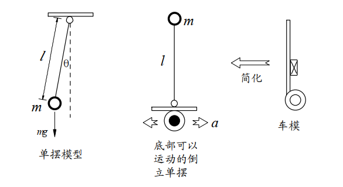
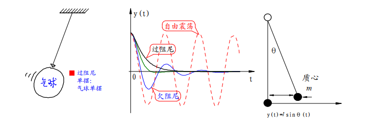
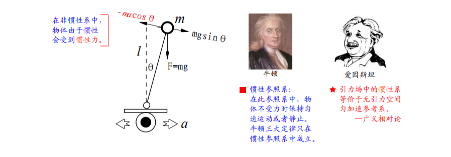
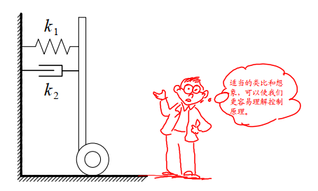

# 动力学分析

为了使得同学们能够比较清楚理解其中的物理过程。下面通过对比单摆模型来说明保持车体平衡的控制规律。

重力场中使用细线悬挂着重物经过简化便形成理想化的单摆模型。直立着的小车可以看成放置在可以左右移动平台上的倒立着的单摆。  

对普通的单摆受力分析。  

当物体离开垂直的平衡位置之后，便会受到重力与悬线的作用合力，驱动重物回复平衡位置。这个力称之为回复力，其大小为

$$F=-mgsin \theta \approx -mg \theta $$

在偏移角度很小的情况下，回复力与偏移的角度之间大小成正比，方向相反。  在此回复力作用下，单摆便进行周期运动。在空气中运动的单摆，由于受到空气的阻尼力，  单摆最终会停止在垂直平衡位置。空气的阻尼力与单摆运动速度成正比，方向相反。阻尼力越大，单摆越会尽快在垂直位置稳定下来。   

不同阻尼系数下，单摆的运动曲线也不同。  

总结单摆能够稳定在垂直位置的条件有两个：  

1. 受到与位移（角度）相反的恢复力；  

2. 受到与运动速度（角速度）相反的阻尼力。  

如果没有阻尼力，单摆会在垂直位置左右摆动。阻尼力会使得单摆最终停止在垂直位置。阻尼力过小（欠阻尼）会使得单摆在平衡位置附件来回震荡。阻尼力过大（过阻尼）会使得单摆到达平衡位置时间加长，比如气球单摆。因而存在一个临界阻尼系数，使得单摆稳定在平衡位置的时间最短。  

为什么倒立摆在垂直位置时，在受到外部扰动的情况下，无法保持稳定呢？我们来分析倒立摆的受力。  

倒立摆之所以不能象单摆一样可以稳定在垂直位置，就是因为在它偏离平衡位置的时候，所受到的回复力与位移方向相同，而不是相反！因此，倒立摆便会加速偏离垂直位置，直到倒下。

如何通过控制使得倒立摆能够像单摆一样，稳定在垂直位置呢？要达到这一目的，只有两个办法：一个是改变重力的方向；另一个是增加额外的受力，使得恢复力与位移方向相反才行。显然能够做到的只有第二种方法。

控制倒立摆底部车轮，使得它作加速运动。这样站在小车上（非惯性系，以车轮作为坐标原点）分析倒立摆受力，它就会受到额外的惯性力，该力与车轮的加速度方向相反，大小成正比。这样倒立摆所受到的回复力为： 

$$
F=mgsin \theta -macos \theta \approx mg \theta -mk_1 \theta
$$
​    （2-1）

式中，由于$$\theta$$很小，所以进行了线性化。假设负反馈控制是车轮加速度$$\alpha$$与偏角$$\theta$$成正比，比例为$$k_1$$ 。如果比例$$k_1>g$$ （ $$g$$是重力加速度），那么回复力的方向便于位移方向相反了。

此外，为了使得倒立摆能够尽快地在垂直位置稳定下来，还需要增加阻尼力。虽然存在着空气和摩擦力等阻尼力，相对阻尼力比较小。因此需要另外增加控制阻尼力。增加的阻尼力与偏角的速度成正比，方向相反。因此式（2-1）可变为

$$F=mg \theta -mk_1 \theta -mk_2 \theta ^1$$ （2-2）

按照上面的控制方法，可把倒立摆模型变为单摆模型，能够稳定在垂直位置。因此，可得控制车轮加速度的控制算法

$$a=k_1 \theta+k_2 \theta ^1$$ （2-3）

式中，$$\theta$$ 为车体倾角；$$\theta ^1$$为角速度；$$ k_1$$、$$k_2 $$均为比例系数；两项相加后作为车轮加速度的控制量。只要保证在$$k_1>g$$、$$k_2>0$$条件下，可以使得车体像单摆一样维持在直立状态。其中有两个控制参数$$k_1 k_2$$，$$k_1$$决定了车体是否能够稳定到垂直平衡位置，它必须大于重力加速度；$$k_2$$决定了车体回到垂直位置的阻尼系数，选取合适的阻尼系数可以保证车体尽快稳定在垂直位置。

