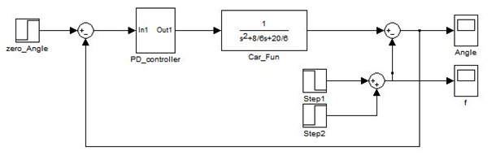
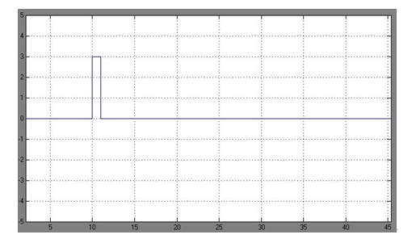
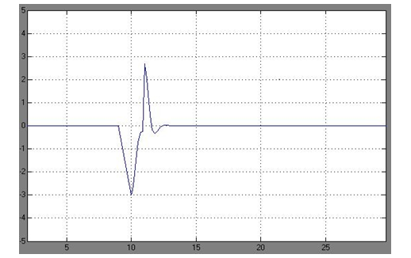

# Simulink仿真

通过对两轮自平衡小车系统进行动力学分析和数学建模，在理论上设计出了控制方法。下面，调用 Matlab 软件的Simulink 仿真工具包对两轮自平衡小车的控制系统数学模型进行仿真验证，观察角度在干扰信号的作用下的自恢复情况。

在 Simulink 文件中，建立两轮自平衡小车的数学模型，调用 PID 控制器构成控制系统的主要部分。设定输入信号值为 0，代表角度初始值为 0，小车初始在平衡位置。对输出节点，调用两个 Step 模块，通过设定 Step Time，使之构成宽度为 1s 的脉冲信号作为小车的外力干扰作用信号。整体系统构成负反馈形式。

仿真系统中示波器 Angle 与 f 分别表示角度变化波形与外力作用信号波形。点击运行，可以看到外力作用为标准的脉冲信号。

此时，在脉冲信号作为干扰的情况下，Angle 示波器中显示了车体角度的变化值。

通过波形可以看出，角度在外界干扰的情况下，能够在一定时间内自动恢复到稳定状态。这证明了前文建立的两轮自平衡小车控制系统的数学模型是有效的，为接下来设计小车的软硬件系统提供了坚实的理论支持。
